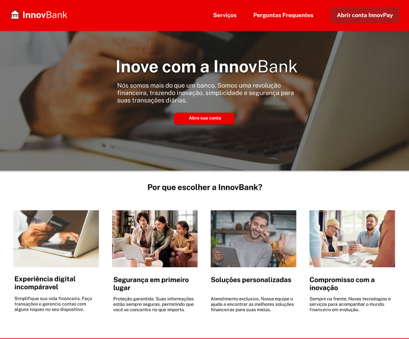

<h1 align="center">README</h1>

  <a href="#-tecnologias">Tecnologias</a>&nbsp;&nbsp;&nbsp;|&nbsp;&nbsp;&nbsp;
  <a href="#-sobre-o-projeto">Sobre o Projeto</a>&nbsp;&nbsp;&nbsp;

  

  <a href="https://vs12-front-01-html-e-css-financeiro.vercel.app/" target="_blank">➡️ Acesse o deploy!</a>

## 🚀 Tecnologias

Esse projeto foi desenvolvido com as seguintes tecnologias:

- Javascript
- API JSON Placeholder
- HTML
- CSS
- Bootstrap

## 💻 Sobre o Projeto

O projeto consiste em uma aplicação web para o banco chamado InnovBank. Por meio dela, pode-se obter informações sobre a InnovBank bem como fazer cadastro e/ou login no banco.

- <a href="https://www.figma.com/file/oCVLCjUfilHXaCm0uYDRRY/InnovBank?type=design&node-id=0%3A1&mode=design&t=yFthjIAdjlOx2gDC-1">Link do Figma</a>
